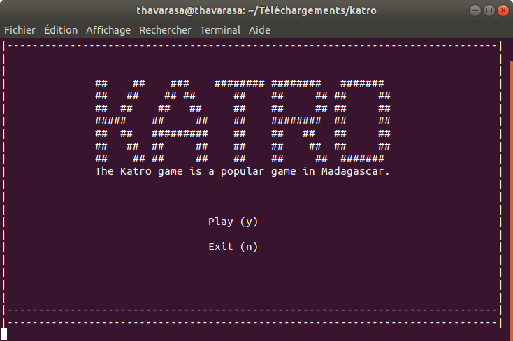
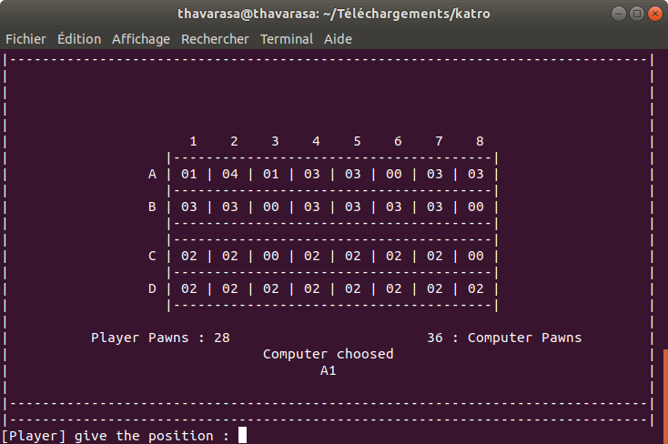

# Terminal-Katro
Katro game play against the computer written in C for linux terminal.(French) 

## La description
Le jeu de "KATRO" est d’origine africaine plus précisément il provient de
Madagascar, qui peut être joué par tout le monde. C’est un jeu amusant mais
comme d’autre, il demande beaucoup de réflexion. Le but du jeu est de pouvoir
récupérer tous les pions de l’adversaire. Celui qui n’a plus de pions sera vaincu.
Le jeu se présente par rangées de trous dans le sens de la largeur du plateau :
soit 12 ou 8 ou 6 dans chaque trou, on y trouve 2 pions. Le jeu de "KATRO"
est joué par deux personnes qui tiennent chacune 2 rangées. La personne qui
commencera la partie peut choisir le trou, elle prendra les pions dans un des
trous à lui pour les distribuer dans ses autres trous. Elle récupèrera les pions
de son adversaire qui se trouve en face du trou où elle termine son partage. Si
son dernier pion tombe dans un de ses trous non vide, elle y prendra tous les
pions et recommence à les distribuer dans ses autres trous... et ainsi de suite.
Mais le tour passe à l’adversaire si son dernier pion tombe dans un trou vide.
Les joueurs récupèreront les pions de la rangée de la seconde ligne côté adver-
saire, seulement quand la première ligne est vide, celui qui n’a plus de pions sera
vaincu.

## Comment lancer le jeu?
Téléchargez et extraire le zip puis exécutez la commande ci-dessous avec le terminal dans le dossier katro.
```bash
make build && ./game
```

## Screenshots


